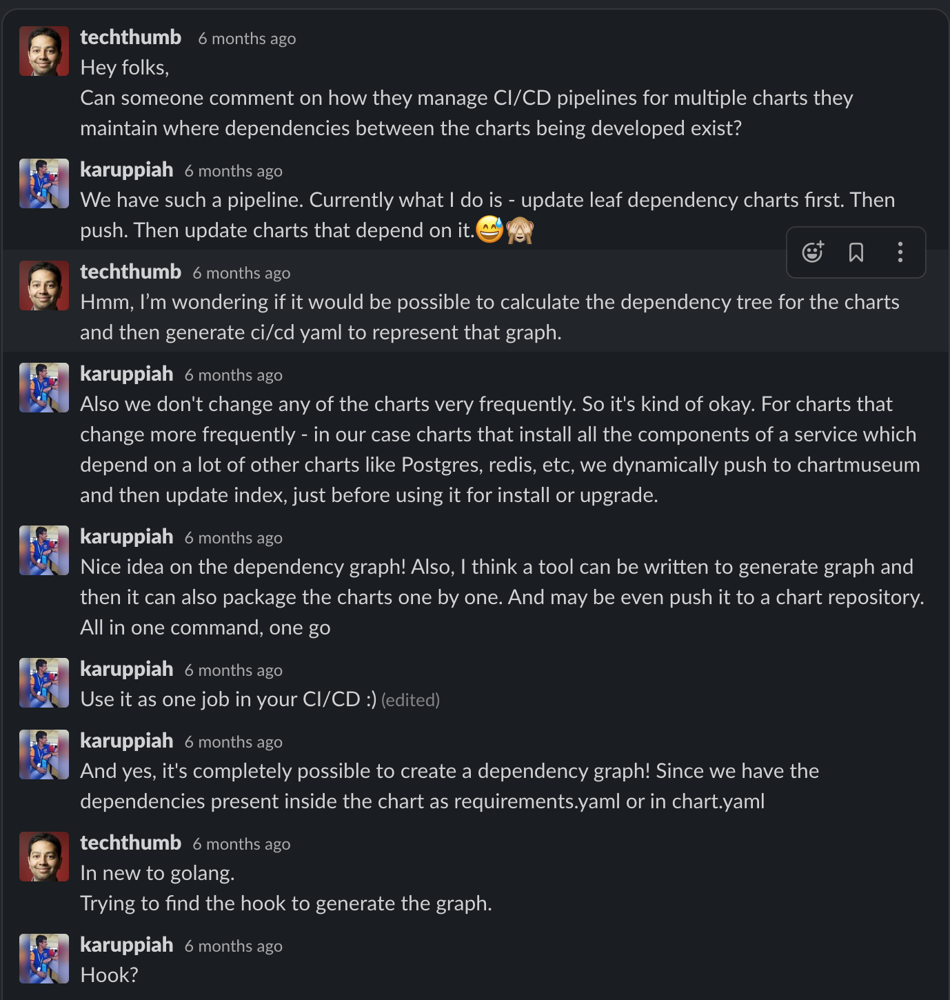
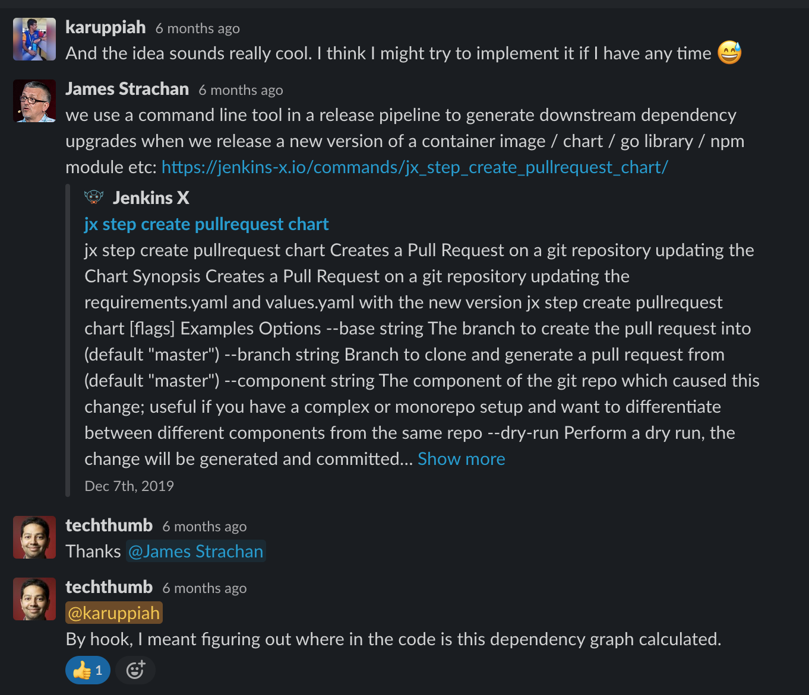

# The Story

So, the one liner is this - in my current project, we have this GitLab CI pipeline for a GitLab repo
which contains our helm charts, and the pipeline runs to push all the charts to
[chartmuseum](https://chartmuseum.com/). The pipeline is too slow for me 🙈 I like to make my life easier
and smooth and fast. This is my attempt to do just that - make it easier for me to push charts faster and to
also fail fast if there are any issues in the pipeline! :)

Also, a lot of the ideas started from here https://kubernetes.slack.com/archives/C0NH30761/p1575737530228200





I'll keep updating this story with more details about the problem I'm trying to solve. I have written
down the problems and ideas in multiple places. 🙈 😅

These are some of the things I wrote in my notes:

1. Push all charts to a chart repo - fast is key
2. When the chart already exists in chart repo, it should not be pushed and no error should come if existing chart present in chart repo and the chart being pushed are the same. Also, try to not download the chart from chart repo to do this check. Use head request or other ways using the http API. See if that's possible
3. When there are child charts to be pushed. Push child charts first. Then parent charts. This way, you can push both at once. First child, then parent will be pushed later. Draw a graph and walk it and push. For lock files - no issues if versions are exact. But there might be issues if versions are not exact! Like range. Or else lock files can be generated. Think on this. How to solve lock file updation.
4. Current pipeline pushes charts one by one in sequence. We can parallelize it. Like have 10 or so threads (workers) that keep picking up tasks of pushing charts. Given a worker, it looks if there's a task to be done, and then does it. Check if there are frameworks for this. The task is to push a chart. In which order should the charts be pushed is a question that comes when you want to solve 3. Especially let's say there are 10 child charts, and 10 workers, and the remaining charts are parent charts and their parents and so on. The first ten workers spawn up, push the charts, let's say one of them has done it really fast cuz it's a small and simple chart, it takes up a parent chart. Now, if this parent depends on a child chart that some worker is still pushing or going to push, then that's a problem. Parallelizing this may not be easy. One way to do this would be - the tasks will be given in such a way that, there are dependent tasks. So if a task's dependencies are done, then that task is put in the task queue for the workers to pickup. How does that sound? Hmm? Makes sense?
5. Also, when child charts and parent charts are involved, and are updated in a single go, then we need to run repository update every time, before doing anything. Actually, come to think of it, helm dependency update already does that, no?

---

Tasks:

1. Write module code to push one chart. Do TDD.

2. Write module code to read charts from a directory. Any directory with Chart.yaml is a chart.

3. Write module code to validate chart from a directory. Only valid charts must be pushed. If linting fails, it must not be pushed I guess. Think on this!

---

Some things to note -

- helm push plugin has quite some configurations that can be done using multiple
  flags. See below the flags it has based on version `0.8.1`

```bash
$ helm push -h
Helm plugin to push chart package to ChartMuseum

Examples:

  $ helm push mychart-0.1.0.tgz chartmuseum       # push .tgz from "helm package"
  $ helm push . chartmuseum                       # package and push chart directory
  $ helm push . --version="7c4d121" chartmuseum   # override version in Chart.yaml
  $ helm push . https://my.chart.repo.com         # push directly to chart repo URL

Usage:
  helm push [flags]

Flags:
      --access-token string             Send token in Authorization header [$HELM_REPO_ACCESS_TOKEN]
      --auth-header string              Alternative header to use for token auth [$HELM_REPO_AUTH_HEADER]
      --ca-file string                  Verify certificates of HTTPS-enabled servers using this CA bundle [$HELM_REPO_CA_FILE]
      --cert-file string                Identify HTTPS client using this SSL certificate file [$HELM_REPO_CERT_FILE]
      --check-helm-version              outputs either "2" or "3" indicating the current Helm major version
      --context-path string             ChartMuseum context path [$HELM_REPO_CONTEXT_PATH]
      --debug                           Enable verbose output
  -d, --dependency-update               update dependencies from "requirements.yaml" to dir "charts/" before packaging
  -f, --force                           Force upload even if chart version exists
  -h, --help                            help for helm
      --home string                     Location of your Helm config. Overrides $HELM_HOME (default "/Users/karuppiahn/.helm")
      --host string                     Address of Tiller. Overrides $HELM_HOST
      --insecure                        Connect to server with an insecure way by skipping certificate verification [$HELM_REPO_INSECURE]
      --key-file string                 Identify HTTPS client using this SSL key file [$HELM_REPO_KEY_FILE]
      --keyring string                  location of a public keyring (default "/Users/karuppiahn/.gnupg/pubring.gpg")
      --kube-context string             Name of the kubeconfig context to use
      --kubeconfig string               Absolute path of the kubeconfig file to be used
  -p, --password string                 Override HTTP basic auth password [$HELM_REPO_PASSWORD]
      --tiller-connection-timeout int   The duration (in seconds) Helm will wait to establish a connection to Tiller (default 300)
      --tiller-namespace string         Namespace of Tiller (default "kube-system")
  -u, --username string                 Override HTTP basic auth username [$HELM_REPO_USERNAME]
  -v, --version string                  Override chart version pre-push
```

Some might not make sense, for example, tiller related stuff will not make sense
for Helm v3. Also, Helm v2 will be gone soon. As in, the support for it - in
terms of bug fixes and security fixes and the feature development for it has
already been stopped. Only Helm v3 will get new features. So yeah. I guess it's
better to mainly support v3 and not have any flags related to tiller and all.

To start with, I'll not bring in these flags. At some point, I need to 😅

---

I can see that there are lot of command level features in the helm push plugin
code, other than the package code.

I was thinking if I should use exec and execute and helm push command. Hmm.

So, I was trying to think what kind of functionality this tool is trying to
provide.

The idea is to be a wrapper tool - to be built on top of helm push and provide
the extra feature of bulk push. Keep it fast. And also support pushing charts
which are interdependent.

So, the code of this tool will contain logic for features like

- Bulk push charts in a concurrent and parallel manner
- Know the dependency among charts and accordingly push the charts in proper
  order. This order will be determined after drawing a dependency graph of all
  the charts

What I thought was - may be, I can provide the above features and let users
hook into the whole functionality of helm push, by letting them tell what is
the command they want to run for each chart. A user interface like this -

```bash
$ helm push-all all-my-charts --command "helm push {.Chart} chartmuseum-repo"
```

And the above is kind of the simplest feature. For the simplest feature, without
all the options and complex features, I could also provide

```bash
$ helm push-all all-my-charts chartmuseum-repo
```

If they want to use all the crazy options and all, they could just use the
previous and it will invoke the helm push command. Some things to note when it
comes to invoking commands / executing commands, the environment variables that
the command has access to, and the working directory it's present in. Ideally
it should be the same as what's accessible to helm-push-all and where
helm-push-all is running

---

Decisions

1. Support only Helm v3 at the moment. Don't do extra work to make v2 work. If
   it comes for free, all cool. Or else not needed. But Helm v3 must be supported!

---

The first task I'm doing is - read all charts from a directory.

Modules

1. Write module code to read charts from a directory. Any directory with
   Chart.yaml is a chart but there's more to it. So it's better to use proper
   functions from Helm or Helm push to try to load the chart and if it's a valid
   chart it'll be able to load, or else it will not load.

So, what I'm going to do is, if some file or directory is not a valid chart
or not a chart at all, I'm going to silently ignore it and have warning
messages for those files / directories.

---

Running tests in GitHub Actions

I found this cool repo to help with this!

https://github.com/mvdan/github-actions-golang

It shows how GitHub actions can run a matrix of tests - different golang
versions and different platforms. I'm thinking of running it just for Mac OS
and go v1.14.x for now. I think I could support linux too! :) Let me just run
the tests in linux too. Windows, may be not. Will try to support this later if
needed. Or...okay, let me keep it, for tests. If there are any issues, based on
that I'll think about it.

Changing this

```yaml
jobs:
  test:
    strategy:
      matrix:
        go-version: [1.13.x, 1.14.x]
        platform: [ubuntu-latest, macos-latest, windows-latest]
```

to this

```yaml
jobs:
  test:
    strategy:
      matrix:
        go-version: [1.14.x]
        platform: [ubuntu-latest, macos-latest, windows-latest]
```

I forgot to add caching for golang modules. The same repo mentions about
caching using

```yaml
- uses: actions/cache@v2
  with:
    path: ~/go/pkg/mod
    key: ${{ runner.os }}-go-${{ hashFiles('**/go.sum') }}
    restore-keys: |
      ${{ runner.os }}-go-
```

I tried to understand the above here

https://help.github.com/en/actions/configuring-and-managing-workflows/caching-dependencies-to-speed-up-workflows

https://help.github.com/en/actions/configuring-and-managing-workflows/caching-dependencies-to-speed-up-workflows#using-the-cache-action

---

Now that I have read all the charts, I'm thinking about how to create an order
for the charts, so that they can be pushed in the right order.

Also, I have started writing code for Helm v2 too. Not sure about it now. I mean,
many people still use v2. Hmm. I think the only data that matters for this tool
is

- Chart name
- Chart version
- Chart Metadata API version (v1/v2)
- Chart requirements
  - Chart name
  - Chart repository URL

One thing to note is, when people update a child chart and it's parent chart,
in the parent chart, they will not be able to get the lock file for the new
child chart version, they can only make the change in `Chart.yaml` or
`requirements.yaml`, but can't get the new `Chart.lock` or `requirements.lock`.
For this, the child chart has to be pushed to the chart repo, and then the
parent chart can do `helm dependency update` to get the correct lock file for
the new chart dependency. So, for this whole thing to happen

- Child chart must be pushed first to the chart repo
- Repo index in local must be updated to reflect in the index that the child
  chart has been pushed and is available
- Helm dependency update can be run in the parent chart to get the new lock file
- The parent chart can be packaged and pushed

What does this mean? This would mean that, people don't need to maintain the
requirements.lock file in their git repo. Instead, it would be taken care by
this tool and overridden even if present, and overriden with correct value, and
then pushed to chart repo. So, it's best not to store it in the git repo, as
it's not going to be the correct value, given the correct value will be detected
only when the CI/CD pipeline runs the tool or you need to run the tool locally,
and see how to add and commit the lock file. But the tool is ideally meant to be
run in the pipeline, for a git ops workflow.

I need to check how the helm push works along with dependency update flag or
I can manually run it, to make sure that even if the user misses, the tool makes
sure that dependency update happens.

---

Expectation is, the user will most probably have all the charts in a directory.
Each chart will be a directory.

---

For the order of charts

- I first need all the dependencies of each chart, and I
  could get this when I read the charts from the directory
- After this, I could go through the list of charts once and create a parent
  relationship for each chart and also find the charts with 0 dependencies
- Push the charts with 0 dependencies and then notify their parents that they
  have been pushed. When all the child charts (dependencies) of a parent chart are
  pushed, the parent chart will be pushed. To do this, after every notification
  the parent chart receives from the child chart, it will check if all it's child
  charts are pushed, so that the parent chart can be pushed

For pushing charts and that too for pushing them with concurrency and
parallelism, I was thinking of a job queue and worker model.

Initially spawn some workers, in golang, some go routines I guess. And then the
workers will read from a job queue and do it's work. In golang, I can use
channels, preferably buffered channels, with buffer size as total number of
charts in the directory.

---

Possible problems:

1. Based on code, we think that all the chart names will be unique. This is
   considering that all the charts will be present as directories in one directory.
   In this case, by the OS's restriction, all the directories will have unique
   name, so all good. But, if there are any tar balls which have the same name
   as another chart present as a directory, if there are different tar balls, each
   with same name, but different chart versions, or may be even same chart version
   but tar ball file names are different because of OS's unique file / directory
   name restriction, then there could be problems
2. What if the parent chart is referring to a version of child chart that does
   not exist in the directory itself. Currently the code is not going to worry
   about the version of child chart present in the parent chart. This is because
   the version can be represented as a range and more in the usual yaml, which
   is requirements,yaml or Chart.yaml , and the exact versions are present only
   in the lock file and as we already saw, we are going to recreate the lock file
   and so, that's something out of question, we aren't going to believe that for
   latest information. So, either I need to check if the child chart referred to
   in the same directory satisfies the chart version mentioned by the parent chart,
   or else, error has to be thrown for parent chart to use the correct child chart
   version.

---

https://duckduckgo.com/?t=ffab&q=task+with+dependencies+scheduling&ia=web

https://stackoverflow.com/questions/59317200/task-scheduling-problem-with-task-dependencies

https://en.wikipedia.org/wiki/Job_shop_scheduling

http://citeseerx.ist.psu.edu/viewdoc/summary?doi=10.1.1.143.5570

---

At a technical level, the problems to solve are

- Parallel execution of tasks. Task being - building, packaging and pushing
  charts. Tasks have dependencies as charts have dependencies. The parallelism
  can be controlled.

- Dependency Graph walking problem. The charts have dependencies. Looks like we
  might need to walk the graph to understand about it. What we need? The
  dependencies among the different charts - a full view of the dependency
  graph - with some data like, what are the leaf nodes. This already directly
  ties to the parallel execution as it's completely based on the dependency
  graph - which translates to the task dependency

---

Graph traversal algorithms for Helm Chart dependency graph traversal

https://ieeexplore.ieee.org/document/6267875

https://en.m.wikipedia.org/wiki/Graph_traversal#/media/File%3AGraph-scan.png

https://en.m.wikipedia.org/wiki/Graph_traversal

What do I need? BFS? DFS? Hmm

Directed Acyclic Graph? Or just Directed Graph? Can Charts have cyclic dependencies? Possible? Think about it. Maybe it's possible, with different versions.

Chart C V2 depends on Chart A v2. Chart A v2 depends on Chart C v1. Chart C v1 depends on Chart A v1

Similar cyclic dependency can happen. Not exactly cyclic. Not cyclic if you consider a node to be a combination of both Chart and Chart Version, which is the ideal thing :)

Always check what is the version of the chart each chart is dependent on. If you don't check that, then in the above case what we end up doing is

Create a cyclic graph with C depending on A which in turn depends on C and again depends on A. Totally cyclic. In this case, we then won't be sure of what chart to push first. It's possible that only Chart C v2 needs to be pushed and everything else is already pushed. Or, another example is, Chart A v2 needs to be pushed first and then Chart C V2. It really depends on how the git push and git commit was done and at what time the chart push all operation is being done :)

Topological Sort! Perfect!!

https://softwareengineering.stackexchange.com/a/316406/363229

https://en.m.wikipedia.org/wiki/Topological_sorting

https://www.geeksforgeeks.org/find-the-ordering-of-tasks-from-given-dependencies/

https://patterns.eecs.berkeley.edu/?page_id=609#Variations

But topological sort will work easily with only one worker. We want parallel multiple workers. So, we need to know that task dependencies are finished and only then we can execute the others

https://dzone.com/articles/parallelizing-tasks-with-dependencies-design-your

https://medium.com/@TRikace/parallelizing-tasks-with-dependencies-design-your-code-to-optimize-performance-d0948549f1eb

https://taskfile.dev

https://taskfile.dev/#/usage?id=task-dependencies

https://github.com/go-task/task

https://awesomeopensource.com/projects/task-runner

Simple solution for now

Golang channels will have tasks

Who will put tasks? Initially the usual flow where leaf node charts are queued.

Later, a goroutine will check the result channel that workers report to. This goroutine will create more tasks in the channel if a task can be successfully run - it's dependencies have successfully run

Failures? Gotta see

When to stop? When all charts are pushed. We know chart count. So all good

Top down approach vs bottom up approach. Best approach is all based on time - execution time, almost no waiting or idle time. Ensure there's no idle or waiting time

Also, the task creation goroutine currently would have to linearly check what tasks can be run next, if any, every time a result comes back from the workers

Gotta check about async programming in golang

With top down, for every chart, it has to wait for its dependencies to be over. Is that good? Is there some proper async way for that? Also when doing it in parallel, multiple duplicate tasks shouldn't run. Hmm. Task completion must be known here too! :)

Leaf nodes or charts are the ones with zero out degree :) out count. Outer directed edge count. There must be algorithms to find that too :)

Some of the chart may not have any dependencies on any of the internal charts or just a part of the internal charts (of the git repo). Consider that case too. If all are dependencies are external chart repo charts, then they are also leaf nodes :) We are mainly looking at internal chart repo dependencies ONLY :)

---

I was just now reading all the code I had written. I'm not sure if I wrote them
or someone else wrote them. It all looks clean and good. But yeah, I don't know
why I have done somethings in some way. Lol :P But it looks sensible enough as
I can't think of any possible alternatives :P :P

---

Looks like I have already written a module to read the charts. Nice! I was just
reading a bit of the story from above.

One thing I noticed in the code was that the warnings are just strings. I saw it
in the test. I think we might have to make them a bit better. As the warnings
have no context - what file / directory got that warning.

I'm going to add that now itself cuz a simple solution is just too easy.
